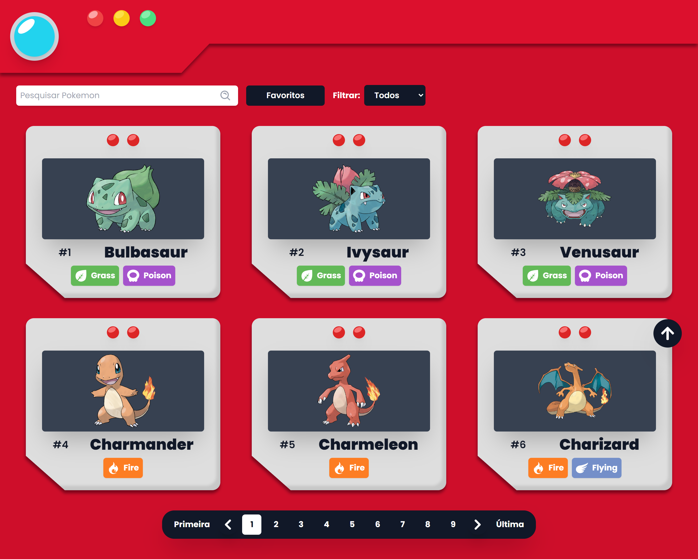
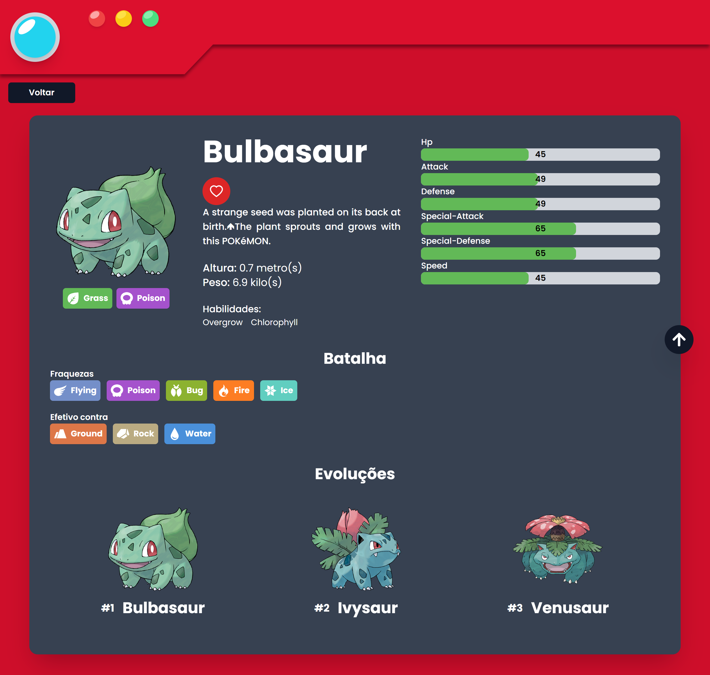

# PokeReact



Essa Pokédex é um projeto em React que utiliza a biblioteca TailwindCSS para estilização e consome dados da PokeAPI para exibir informações sobre os Pokémons.

## 🔗 Acesso ao Site

Você pode acessar o projeto hospedado no Netlify através deste link:
https://pokedex-jose.netlify.app/

## 🚀 Instalação

Para instalar o projeto, siga os seguintes passos:

1. Clone o repositório:
   ```
   git clone https://github.com/Eujosee/Pokedex.git
   ```
2. Acesse a pasta do projeto:
   ```
   cd Pokedex
   ```
3. Instale as dependências:
   ```
   npm install ou npm i
   ```
4. Inicie o servidor:
   ```
   npm run dev
   ```
5. Acesse o projeto no link informado

## 💡 Utilização

Ao acessar o projeto, você verá uma lista de Pokémons. Clique em um deles para exibir mais informações, como habilidades, características, estatísticas e evoluções.

Você também pode pesquisar um Pokémon específico utilizando a barra de pesquisa, digitando o nome, ou filtrar por tipo.

## 🛠️ Tecnologias Utilizadas

- [React](https://react.dev/learn)
- [TailwindCSS](https://tailwindcss.com/docs/installation)
- [PokeAPI](https://pokeapi.co/docs/v2)
- [Axios](https://axios-http.com/ptbr/docs/intro)
- [React Router DOM](https://reactrouter.com/en/main)
- [React Icons](https://react-icons.github.io/react-icons/)
- [Toastify](https://fkhadra.github.io/react-toastify/introduction)

## 📷 Capturas de Tela

Aqui estão algumas capturas de tela do projeto:

- Tela inicial


- Detalhes do pokemon


## ⚠️ Avisos

- O flavor text dos pokémons está em inglês, pois a API ainda não disponibiliza a versão em português.
- Alguns pokémons, por serem recentes, não possuem imagens disponíveis 

## 🙏 Créditos

Imagem de fundo da página 404 por:
https://www.deviantart.com/willdinomaster55/art/Field-Background-5-910270961

## 📝 Licença

Este projeto está sob a licença MIT. Consulte o arquivo [LICENSE](LICENSE) para mais detalhes.
